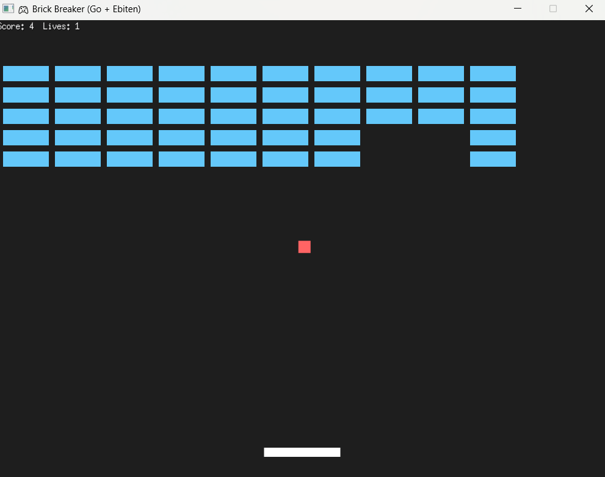

# 🎮 Brick Breaker – Go + Ebiten Game

🎮 Brick Breaker is a fast-paced arcade game built in Go using Ebiten.  
Bounce the ball, break all the bricks, and test your reflexes.  
Simple controls, smooth gameplay, and no installation needed — just download and play!

---

## 🔧 Features

- Paddle & ball physics
- Brick collision detection
- 3 lives with restart
- Score counter
- Runs as standalone `.exe`

---
## ScreenShot




## ▶️ How to Play

| Action      | Key         |
|-------------|-------------|
| Move Left   | ← Arrow     |
| Move Right  | → Arrow     |
| Launch Ball | Auto Start  |
| Quit        | Close Window |

---

## 💻 Run It Yourself

### ▶️ From Source (Go installed)
```bash
git clone https://github.com/mekhushi/brickbreaker.git
cd brickbreaker
go run .
